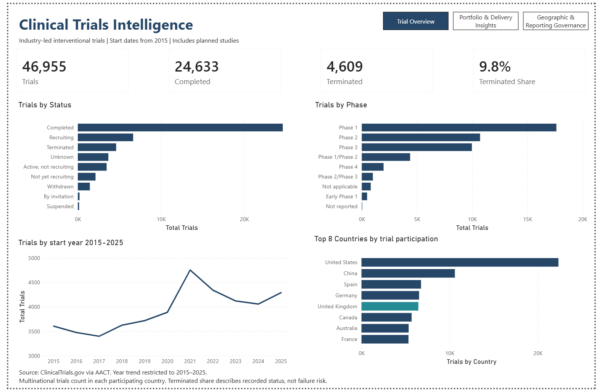

# Clinical Trials Intelligence

**PostgreSQL · Power BI · DAX | Global trial activity with a UK lens**

A three-page dashboard analysing **46,955 industry-led interventional drug and biological trials**. Built to help a UK pharmaceutical or biotechnology portfolio strategy team explore trial activity, operational requirements, geographic participation and public results visibility.



[Power BI report](report/clinical_trials_intelligence.pbix) · [Portfolio & Delivery preview](screenshots/portfolio-delivery.png) · [Geographic & Reporting preview](screenshots/geography-reporting.png)

## What I built and why

I investigated 12 stakeholder questions in SQL, prepared trial-level data in PostgreSQL, modelled multinational participation with a separate country bridge, and created DAX measures and three Power BI pages. The aim was to turn a complex registry into a clear view of portfolio scale and delivery characteristics without double-counting trials.

| Dashboard page | Stakeholder question | Intended use |
| --- | --- | --- |
| Trial Overview | Where is activity concentrated by phase, status, year and country? | Establish a portfolio benchmark and identify areas for further investigation. |
| Portfolio & Delivery Insights | How do enrollment, site footprint and recorded timelines differ by phase? | Inform recruitment feasibility and site-network planning discussions. |
| Geographic & Reporting Governance | How is the UK represented, and where are public results less visible? | Review geographic assumptions and prioritise evidence-availability follow-up. |

These are intended decision uses for a student portfolio project; stakeholder adoption and business impact have not been measured.

## Findings

- **Operational scale:** Phase 3 median recorded enrollment is **312**, versus **36** in Phase 1; median recorded sites are **24** versus **1**. Later-phase planning needs to account for a larger recruitment and site footprint.
- **UK participation:** Among trials with known geography, UK participation is **17.6% for 2015 starts** and **12.8% for 2025 starts**. This supports reviewing geographic assumptions; it does not establish why the share changed.
- **Results visibility:** Among mature eligible trials, results coverage is **18.2% in Phase 1** and **71.3% in Phase 3**. This supports phase-specific review of public evidence availability, not conclusions about regulatory compliance.

Overall, the final export contains **24,633 completed trials**, **4,609 terminated trials (9.8%)**, **6,452 UK trials** and **43.2% results coverage** among **22,021 mature eligible trials**. [Definitions and verified denominators](docs/methodology.md).

[Explore all 12 research questions, SQL and interpretation](docs/research.md).

## Data and approach

Source: [Aggregate Analysis of ClinicalTrials.gov (AACT), Clinical Trials Transformation Initiative (CTTI)](https://aact.ctti-clinicaltrials.org/). The cohort includes interventional studies with an industry lead sponsor, a drug or biological intervention, and a start date from **1 January 2015**. Headline totals include planned future starts; the year charts cover **2015–2025**. The final extraction date is unconfirmed.

```text
AACT → SQL profiling, research and curated exports → trial/country model → DAX → Power BI
```

`FactTrials` has one row per `nct_id`. SQL uses `EXISTS` and pre-aggregates child records to preserve that grain. `BridgeTrialCountry` records country participation: multinational trials can appear in several countries, so country counts are not additive.

## Explore and reproduce

- [Research questions and findings](docs/research.md) and [12-query analysis](sql/03_portfolio_analysis.sql).
- [Source profiling](sql/00_source_profile.sql), [core and bridge validation](sql/01_trial_core_and_bridges.sql), and [curated export SQL](sql/02_curated_views.sql).
- [Source access, ingestion and validation evidence](docs/sources-and-validation.md), including the supporting 200-study Python/API and limited BigQuery workflow.
- [DAX measures](docs/dax.md), [supporting data](data/README.md) and [methodology, QA and execution order](docs/methodology.md).
- Download the PBIX and open it in Power BI Desktop, or use the screenshots above. Source paths may need updating before refresh.
- Run `python scripts/verify_exports.py` to check the supplied CSVs offline; no API extraction or database rebuild is required.

Registry records may be incomplete or planned. Recorded termination is not clinical failure risk; dashboard duration includes ongoing/planned trials, and enrollment type is not retained. Results coverage is not a compliance measure. PBIX interactions and refresh require local verification. Further details are in the methodology.

**Max Pearson · University of Nottingham** — Data Analyst / BI portfolio project. Developed through guided learning; AI assisted repository editing and additional offline QA.
